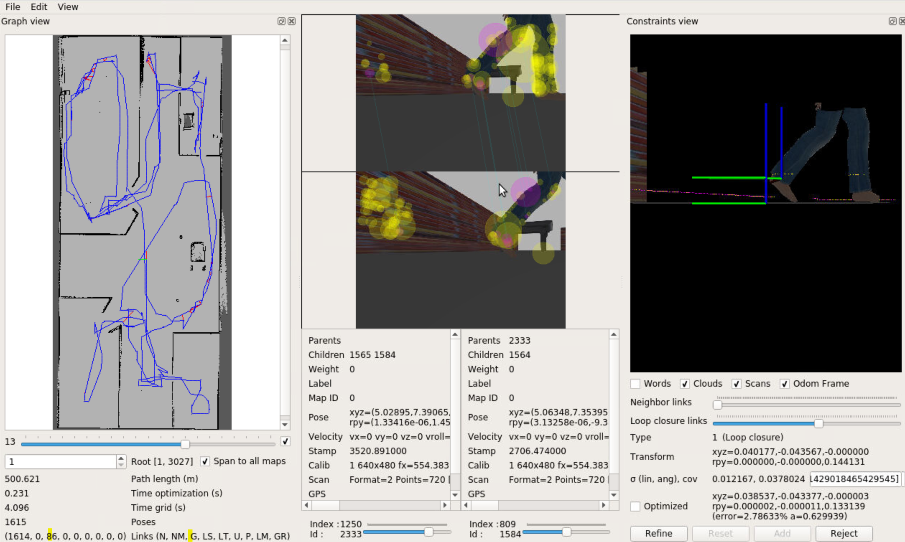

# RTAB Mapping 
The package my robot lauches the RTAB mapping node. After which using teleop_twist_keyboard the robot is moved in the environment to map it.

This is an excercise as a part of the Udacity Robotics Software Engineer Nano degree.

# Demo 



# Usage 


* Install the required dependencies as shown below :

```bash
$ sudo apt-get install ros-kinetic-navigation
$ sudo apt-get install ros-kinetic-map-server
$ sudo apt-get install ros-kinetic-move-base
$ sudo apt-get install ros-kinetic-amcl
```

* Clone the repo. Note that the repo uses git lfs to maintain the large map and rtab database files. Install git lfs as shown below:
```
$ curl -s https://packagecloud.io/install/repositories/github/git-lfs/script.deb.sh | sudo bash
$ sudo apt install git-lfs
```
The above is for debian systems if you need to install in any other follow this [link](https://git-lfs.github.com/)

* Once installed get into the localization directory and follow this:
```
cd MapMyWorld
git lfs install 
git lfs pull
```
Now Catkin make the repo and launch different nodes as shown:

```bash
roslaunch my_robot world.launch
```
```
roslaunch my_robot mapping.launch
```
```
roslaunch teleop_twist_keyboard  teleop.launch
```

The repo already contains a database shown in the demo, path below:

```
MapMyWorld/my_robot/rtabmap.db
```
